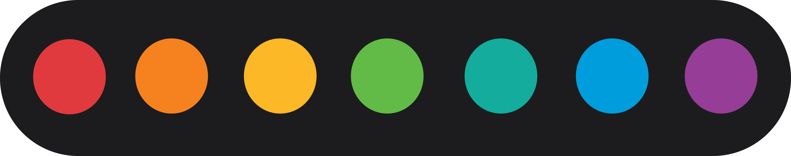
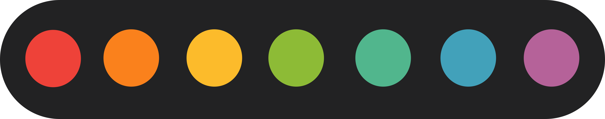
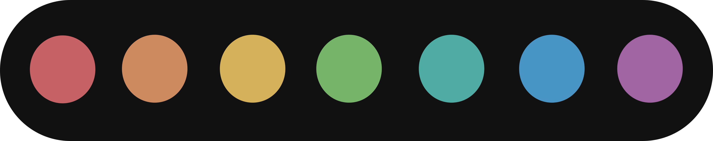
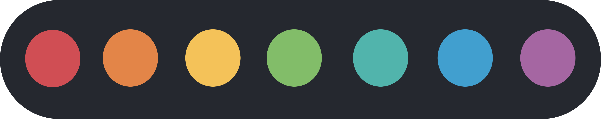
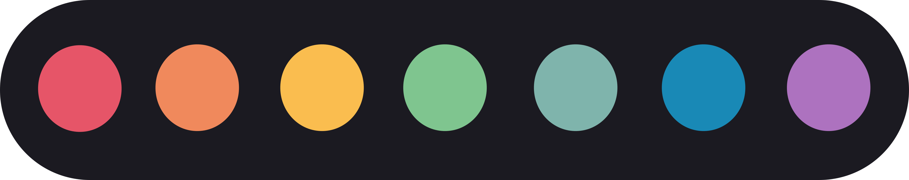
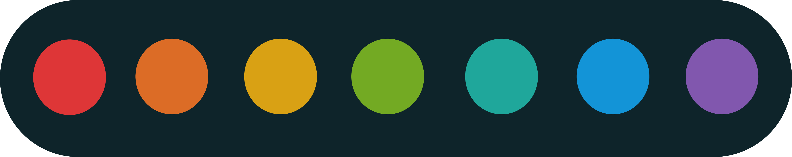

1984 themes merge the base colour scheme, based on the "rainbow" Apple logo, with other colour schemes. This has the effect of making said schemes more neutral and clean, while mainting their character and uniqueness.

# 1984-base

  

Licence: 
    

# 1984-gruvbox

  

Based on https://github.com/morhetz/gruvbox | Licence: 
    

# 1984-mountaineer

  

Based on https://github.com/co1ncidence/mountaineer.vim | Licence: 
    

# 1984-nord

  

Based on https://github.com/arcticicestudio/nord-visual-studio-code | Licence: 
    

# 1984-rose-pine

  

Based on https://github.com/rose-pine/rose-pine-theme
    

# 1984-solarised

  

Based on https://github.com/altercation/solarized | Licence: 
    
